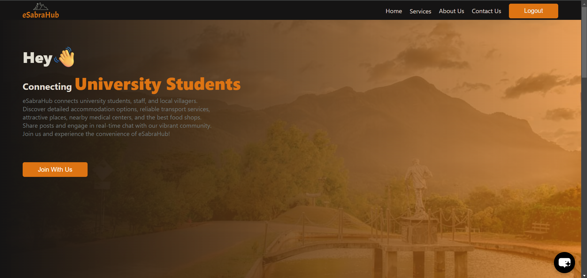

# eSabrahub

**eSabrahub** is a comprehensive connection hub designed for Sabaragamuwa University students, staff, and the local community. The platform aims to provide easy access to essential services and foster a sense of community through various interactive features.




---

## 📚 Table of Contents
1. [Project Overview](#project-overview)
2. [Key Features](#key-features)
3. [Tech Stack](#tech-stack)
4. [Installation & Setup](#installation--setup)
5. [Usage](#usage)
6. [Google Maps Integration](#google-maps-integration)
7. [Contributors](#contributors)
8. [Contact Us](#contact-us)

---

## Project Overview

**eSabrahub** is designed to address the need for a centralized platform that connects Sabaragamuwa University students, staff, and the local community. It solves the problem of fragmented access to essential services and resources by offering a single hub that integrates information on accommodation, transport, medical centers, food options, and more.

What sets **eSabrahub** apart is its focus on building a sense of community through real-time interactions and tailored recommendations. The platform features user-generated content, such as posts and likes, along with a real-time chat application for seamless communication. The integration of AI offers personalized solutions and automation for a smarter, more efficient user experience.

## Key Features 

- 🏠 **Accommodation, Transport, and Medical Information**  
  Provides easy access to essential resources for students, staff, and the community, all integrated with location details for easy navigation.

- 🌆 **Attractive Places**  
  Users can explore nearby attractive locations, helping them discover local attractions and activities.

- 🍔 **Food Shops**  
  Information on nearby food shops, making it easier to find places to eat.

- 📝 **User-Generated Content**  
  Allows users to add, delete, and share posts. They can also interact with posts through likes and comments.

- 💬 **Real-Time Chat**  
  Enables seamless communication between users, fostering community interaction.

- 🗺️ **Google Maps Integration**  
  Allows users to view locations on an interactive map, making it easier to find accommodation, transport, medical centers, and more.

- 🤖 **AI-Powered Recommendations**  
  Provides personalized suggestions to users based on their preferences and activities, offering a smarter and more efficient experience.

---


## Tech Stack 

- **Frontend**: React.js
- **Backend**: Node.js, Express.js
- **Database**: MongoDB Atlas
- **Authentication**: JWT (JSON Web Token)
- **AI**: Powered by Chatbase for personalized recommendations

---

## Installation & Setup 

### 1. Install Node.js and NPM

Before you begin, make sure you have **Node.js** and **NPM** (Node Package Manager) installed on your machine.

- Visit the official [Node.js website](https://nodejs.org/) and download the latest LTS version for your system.
- After downloading, run the installer and follow the instructions.

You can check if Node.js and NPM were installed successfully by running the following commands in your terminal:

```bash
node -v
npm -v

```
### 2. Clone the Repository

Clone the project repository from GitHub to your local machine.

```bash
git clone https://github.com/prabodhahdev/eSabraHub.git
```
Once the repository is cloned, navigate into the project directory using:
```
cd eSabraHub
```
This will place you inside the project folder, where you can start working with the code.

### 3. Install dependencies for the frontend
```
cd frontend
npm install
```

### 4. Install dependencies for the admin panel
```
cd ../admin
npm install
```

### 5. Install dependencies for the backend
```
cd ../backend
npm install
```
### 6. Setup Environmental Variables
```
cd backend
touch .env
```
Then open the .env file and add the following environment variables:
```
JWT_SECRET=Enter Your Secret Key Here
PORT=5000
MONGO_URI=Your_MongoDb_URL
EMAIL_USER=Adminpanel_User_Name
EMAIL_PASS=Admin_Password
GOOGLE_MAPS_API_KEY=Your_Google_Map_API_Key

```


### 7. Run the frontend admin and backend
```
cd ../frontend
npm start


cd ../admin
npm start


cd ../backend
node index.js
```
The frontend will be available at: http://localhost:3000
The backend will be available at: http://localhost:5000

## Usage

Once the app is running, you can interact with the platform. Here are some of the things you can do:

🏠 Accommodation, Transport, and Medical Information
Provides easy access to essential resources for students, staff, and the community, all integrated with location details for easy navigation.

🌆 Attractive Places
Users can explore nearby attractive locations, helping them discover local attractions and activities.

🍔 Food Shops
Information on nearby food shops, making it easier to find places to eat.

📝 User-Generated Content
Allows users to add, delete, and share posts. They can also interact with posts through likes and comments.

💬 Real-Time Chat
Enables seamless communication between users, fostering community interaction.

🗺️ Google Maps Integration
Allows users to view locations on an interactive map, making it easier to find accommodation, transport, medical centers, and more.

🤖 AI-Powered Recommendations
Provides personalized suggestions to users based on their preferences and activities.

---

## Google Maps Integration
eSabraHub integrates Google Maps to help users easily find locations such as accommodation, transport, medical centers, and food shops. To enable Google Maps functionality:

Obtain a Google Maps API key from Google Cloud Platform.
Add the API key to your .env file as follows:
env
```
GOOGLE_MAPS_API_KEY=your_google_maps_api_key_here
```

---

##  Contributors

**👤 Prabodha**  
**👤 Sandamini**  
**👤 Gavesh**  
**👤 Fashan**

Thank you to all the team members for their contributions to eSabrahub!


---

##  Contact Us

If you have any questions, suggestions, or feedback, feel free to reach out to us!

✉️ **Email**: esabrahub@gmail.com  
🐙 **GitHub**: [https://github.com/prabodhahdev/eSabraHub](https://github.com/prabodhahdev/eSabraHub)

We’d love to hear from you!


